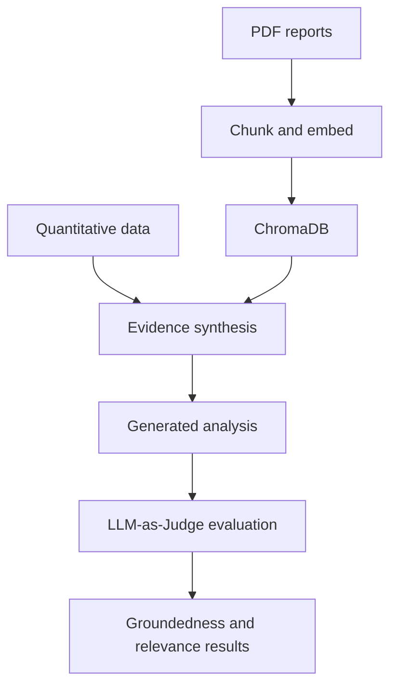

# DualLens Analytics — RAG Evaluation Pipeline

## Context

An investment-oriented research question can require both quantitative business performance and qualitative evidence about an organization's AI initiatives. The project explored a RAG pipeline that combines these two perspectives and evaluates the quality of the generated synthesis.

## Objectives

- Ingest quantitative and document-based evidence.
- Chunk and embed report content for semantic retrieval.
- Retrieve relevant qualitative context from ChromaDB.
- Combine retrieved context with quantitative signals.
- Evaluate generated answers for groundedness and relevance.

## Architecture

The pipeline keeps ingestion, retrieval, synthesis, and evaluation as distinct stages. This separation makes it easier to diagnose whether a weak answer originated from missing source data, poor retrieval, or generation behavior.

## Pipeline stages

| Stage | Responsibility | Key concern |
| --- | --- | --- |
| Data ingestion | Collect quantitative data and documents | Provenance and freshness |
| Document processing | Extract, chunk, and prepare report content | Context preservation |
| Embedding and storage | Create embeddings and store them in ChromaDB | Reproducibility and metadata |
| Retrieval | Select context relevant to the question | Recall and relevance |
| Synthesis | Combine quantitative and qualitative evidence | Faithfulness and uncertainty |
| Evaluation | Judge groundedness and relevance | Stable criteria and reviewability |

## Evaluation approach

The project used LLM-as-Judge evaluation for:

- **Groundedness:** whether the generated analysis is supported by the supplied evidence.
- **Relevance:** whether the response addresses the research question without unnecessary diversion.

For a production-oriented extension, these automated scores should be complemented with representative test sets, deterministic retrieval metrics, threshold calibration, and human review of sampled outputs.

## Reliability and responsible-use considerations

- Keep source provenance with every retrieved chunk.
- Avoid mixing stale quantitative data with current narrative claims without disclosure.
- Treat missing retrieval evidence as uncertainty rather than permission to invent.
- Separate generated conclusions from quoted or retrieved facts.
- Review evaluation prompts and thresholds for bias and inconsistency.
- Present the result as research support, not professional financial advice.

## Technologies and patterns

- RAG
- ChromaDB
- Embeddings
- PDF processing and chunking
- Multi-source synthesis
- LLM-as-Judge
- Groundedness and relevance evaluation

## Engineering lessons

- Retrieval quality and generation quality need separate diagnostics.
- Metadata and provenance are essential when combining multiple evidence sources.
- Automated evaluation is useful for repeatability but does not eliminate human review.
- Quantitative and qualitative inputs should remain distinguishable in the final synthesis.
- Evaluation criteria should be designed with the same care as the generation prompt.

## Repository boundary

This writeup summarizes the design and learning outcomes. Course code, documents, datasets, prompts, and non-distributable artifacts are not included.
