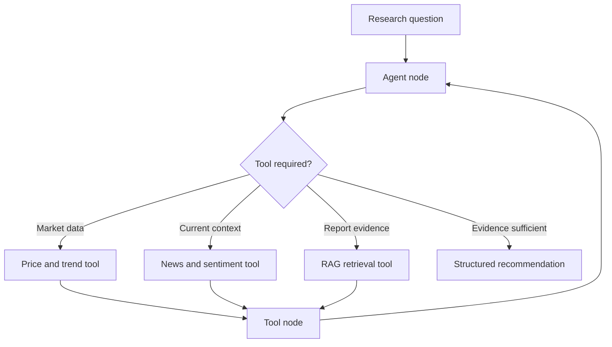

# Autonomous Financial Research Analyst

## Context

Financial research often combines numerical market data, historical trends, news sentiment, and narrative analyst material. The project explored a tool-using agent that could decide which sources to consult and synthesize the evidence into a structured research recommendation.

## Objectives

- Select and call tools based on the research goal.
- Combine quantitative and qualitative evidence.
- Retrieve relevant analyst-report content through RAG.
- Keep the reasoning workflow stateful and inspectable.
- Produce a sourced Buy, Hold, or Sell recommendation within the educational scenario.

## Architecture

A LangGraph state machine coordinates an agent node, a tool node, and conditional routing. The agent chooses among available tools according to the evidence needed rather than following a fixed sequence for every request.

## Evidence sources

| Source type | Purpose |
| --- | --- |
| Current market data | Establish the latest available price context |
| Multi-year performance | Identify longer-term trends |
| News and sentiment | Capture recent qualitative signals |
| Retrieved analyst reports | Ground narrative analysis in relevant documents |

## Workflow

1. Interpret the company and research objective.
2. Identify evidence gaps.
3. Select the appropriate tool.
4. Add tool output to the workflow state.
5. Reassess whether further evidence is needed.
6. Synthesize the collected evidence.
7. Produce a structured recommendation with supporting rationale.

## Reliability and responsible-use considerations

- Preserve source references and timestamps for time-sensitive evidence.
- Distinguish retrieved facts from model-generated interpretation.
- Handle missing, stale, or contradictory data explicitly.
- Avoid presenting sentiment as a substitute for financial fundamentals.
- State uncertainty and evidence limitations.
- Treat the output as an educational research artifact, not financial advice.

## Evaluation approach

The design can be evaluated through:

- correct selection of tools for the research question;
- completeness of quantitative and qualitative evidence;
- faithfulness of summaries to retrieved material;
- consistency between evidence and recommendation;
- behavior when tools fail or return incomplete results;
- presence of source attribution and uncertainty.

This repository does not publish course code, datasets, detailed prompts, or measured investment performance.

## Technologies and patterns

- LangGraph
- LangChain
- Tool calling
- Conditional routing
- RAG
- Sentiment analysis
- Prompt and behavioral-constraint design

## Engineering lessons

- Autonomy depends on clear goals, tool contracts, and stopping conditions.
- Tool outputs require validation before they enter the reasoning state.
- Time-sensitive evidence should carry timestamps and provenance.
- Agent behavior is shaped as much by constraints and routing as by the underlying model.
- A recommendation is more defensible when the evidence path remains visible.

## Repository boundary

This case study is an architecture and learning summary. It does not distribute course implementation materials and must not be treated as a live investment-analysis service.
