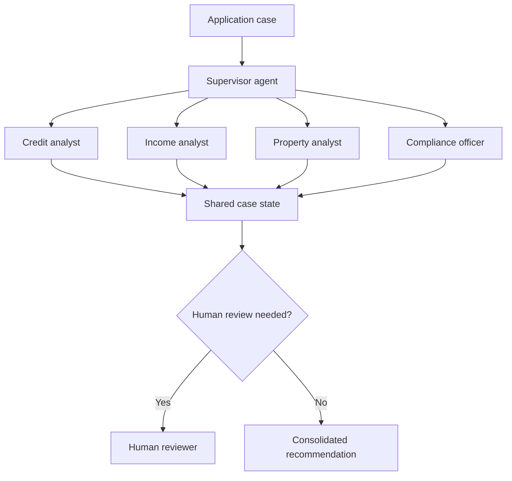

# Multi-Agent Mortgage Underwriting System

## Context

Mortgage underwriting requires several distinct forms of analysis: credit, income, property, and policy or compliance review. The project explored how a coordinated agentic workflow could organize those responsibilities while retaining human oversight for consequential decisions.

## Objectives

- Separate specialist responsibilities instead of asking one agent to perform every analysis.
- Maintain shared case state across the workflow.
- Ground compliance checks in retrieved policy information.
- Protect personally identifiable information (PII).
- Preserve an auditable record of agent outputs and routing decisions.
- Escalate ambiguous or high-risk cases to a human reviewer.

## Architecture

The supervisor coordinates four specialist agents. Each specialist follows a reason-and-act pattern for its bounded responsibility and contributes structured findings to shared workflow state.

## Agent responsibilities

| Agent | Responsibility | Expected output |
| --- | --- | --- |
| Supervisor | Route work, monitor completion, and consolidate findings | Workflow status and consolidated recommendation |
| Credit analyst | Examine credit-related information | Credit findings and risk indicators |
| Income analyst | Assess income information | Income findings and identified concerns |
| Property analyst | Review property-related inputs | Property findings and risk indicators |
| Compliance officer | Compare the case with retrieved policy guidance | Grounded compliance findings and references |

## Workflow

1. Accept and validate the case input.
2. Redact or protect PII before unnecessary model exposure.
3. Initialize shared workflow state.
4. Route the relevant portions of the case to specialist agents.
5. Retrieve policy context for compliance analysis.
6. Consolidate the structured findings.
7. Apply escalation criteria.
8. Send edge cases to human review or produce a recommendation for review.
9. Preserve an audit trail of the workflow.

## Responsible-AI controls

- **Human-in-the-loop:** consequential or ambiguous cases require human judgment.
- **Privacy:** PII redaction limits sensitive-data exposure.
- **Bias awareness:** bias detection is treated as a design requirement rather than an afterthought.
- **Grounding:** policy retrieval supports compliance findings.
- **Auditability:** specialist findings and routing decisions remain traceable.
- **Bounded authority:** the system produces decision support, not autonomous lending approval.

## Evaluation approach

The design can be assessed through:

- routing accuracy for specialist tasks;
- completeness and consistency of shared state;
- groundedness of compliance findings;
- PII-redaction effectiveness;
- escalation behavior for ambiguous scenarios;
- traceability from evidence to the consolidated recommendation.

This repository does not claim production validation or publish course evaluation data.

## Technologies and patterns

- LangGraph
- Hierarchical multi-agent orchestration
- ReAct-style specialist agents
- RAG with ChromaDB
- Human-in-the-loop review
- PII redaction and audit trails

## Engineering lessons

- Shared state needs an explicit schema and ownership rules.
- Specialist boundaries improve clarity only when outputs are structured consistently.
- A supervisor needs deterministic completion and escalation conditions.
- Responsible-AI controls belong in the workflow design, not only in the user interface.
- Human review is a system capability with routing, context, and audit requirements.

## Repository boundary

This writeup describes the architecture and lessons at a high level. Course code, datasets, detailed prompts, and non-distributable materials are intentionally excluded.
